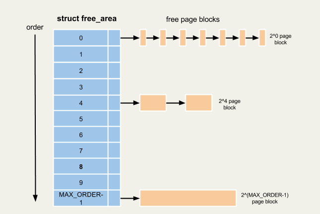

2015-06-07
==========

진행내용
------

### Buddy Allocator

ref: http://woodz.tistory.com/57

```
struct zone {
	struct free_area free_area[MAX_ORDER/*11*/];
};

struct free_area {
     struct list_head    free_list[MIGRATE_TYPES];
     unsigned long       nr_free;
};
```



예를 들어, 위와 같은 상황에 서 16kb 를 할당받으려면, 2^4 = 16, ORDER 4로 가서 메모리할당을 받는다.


