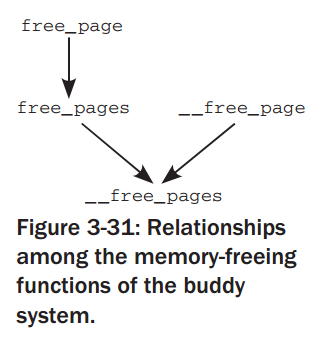

2015-06-20
==========

Summary
-------

- mm/page_allo.c, __alloc_pages_slowpath()진행 중


진행 내용
--------

# __alloc_pages_slowpath()
```C
2774         // 2015-06-20 시작
2775         /* Allocate without watermarks if the context allows */
2776         if (alloc_flags & ALLOC_NO_WATERMARKS) {
2777                 /*      
2778                  * Ignore mempolicies if ALLOC_NO_WATERMARKS on the grounds
2779                  * the allocation is high priority and these type of
2780                  * allocations are system rather than user orientated
2781                  */     
2782                 // NOMAL_ZONE
2783                 zonelist = node_zonelist(numa_node_id(), gfp_mask);
2784         
2785                 page = __alloc_pages_high_priority(gfp_mask, order,
2786                                 zonelist, high_zoneidx, nodemask,
2787                                 preferred_zone, migratetype);
2788                 if (page) {
2789                         goto got_pg;
2790                 }               
2791         }                       
2792         // 2015-06-20, 식사전
```

## __alloc_pages_slowpath() -> __alloc_pages_high_priority()

이 함수의 경우, 인자로 ALLOC_NO_WATERMARKS을 전달한다.
주석을 통해서 watermark를 전혀 고려하지 않는 다는 것을 알 수 있다.
```
367 #define ALLOC_NO_WATERMARKS 0x04 /* don't check watermarks at all */
```

```C
2567 static inline struct page *
2568 __alloc_pages_high_priority(gfp_t gfp_mask, unsigned int order,
2569         struct zonelist *zonelist, enum zone_type high_zoneidx,
2570         nodemask_t *nodemask, struct zone *preferred_zone,
2571         int migratetype)
2572 {                       
2573         struct page *page;      
2574         
2575         do {
2576                 page = get_page_from_freelist(gfp_mask, nodemask, order,
2577                         zonelist, high_zoneidx, ALLOC_NO_WATERMARKS,
2578                         preferred_zone, migratetype);
2579                 
2580                 if (!page && gfp_mask & __GFP_NOFAIL)
2581                         wait_iff_congested(preferred_zone, BLK_RW_ASYNC/*0*/, HZ/*100*//50);
2582         } while (!page && (gfp_mask & __GFP_NOFAIL));
2583                 
2584         return page;
2585 }       
```

이를 기초로 get_page_from_freelist()를 다시 살펴보면, 
ALLOC_FAIR, ALLOC_WMARK_LOW의 flag 조사없고,
zone_reclaim(), zone_watermark_ok()의 수해행없이,
**바로 buffered_rmqueue()를 통해 page를 전달 받는다.**
그 부분이 일반적인 할당과 차이나는 부분이다. 그래서 high priority라는 이름을 붙였나보다?

```
2041 // 2015-06-20
2042 // page = get_page_from_freelist(gfp_mask, nodemask, order,
2043 //                              zonelist, high_zoneidx, ALLOC_NO_WATERMARKS,
2044 //                              preferred_zone, migratetype);
2045 //      
2046 static struct page * 
2047 get_page_from_freelist(gfp_t gfp_mask, nodemask_t *nodemask, unsigned int order,
2048                 struct zonelist *zonelist, int high_zoneidx, int alloc_flags,
2049                 struct zone *preferred_zone, int migratetype)
2050 { 
(skip)...
2073         for_each_zone_zonelist_nodemask(zone, z, zonelist,
2074                                                 high_zoneidx, nodemask) {
2075                 unsigned long mark;
2076 
(skip)...
2089 
2090                 // ALLOC_NO_WATERMARKS 셋 되어 있지 않음
2091                 // 2015-06-20, ALLOC_NO_WATERMARKS을 셋했다.
2092                 if (unlikely(alloc_flags & ALLOC_NO_WATERMARKS))
2093                         goto try_this_zone;
(skip)...
2211 try_this_zone:
2212                 // 현재 cpu에서 사용가능한 페이지를 반환해라
2213                 page = buffered_rmqueue(preferred_zone, zone, order,
2214                                                 gfp_mask, migratetype);
2215                 if (page)
2216                         break;
2217 this_zone_full:
2218                 // CONFIG_NUMA 미설정
2219                 if (IS_ENABLED(CONFIG_NUMA))
2220                         zlc_mark_zone_full(zonelist, z);
2221         } // for_each
```


### wait_iff_congested()

wait queue를 정의하고 스케줄링 등을 한다.
아직 자세히 분석하지는 않았음.

```
622 // 2015-06-20
623 // wait_iff_congested(preferred_zone, BLK_RW_ASYNC/*0*/, HZ/*100*//50);
624 long wait_iff_congested(struct zone *zone, int sync, long timeout)
625 {
626         long ret;
627         unsigned long start = jiffies;
628         // #define DEFINE_WAIT_FUNC(name, function)                \
629         //     wait_queue_t name = {                       \
630         //         .private    = current,              \
631         //         .func       = function,             \
632         //         .task_list  = LIST_HEAD_INIT((name).task_list), \ 
633         //     }
634         DEFINE_WAIT(wait);
635         wait_queue_head_t *wqh = &congestion_wqh[sync]; // 2015-06-29, sync(0)
636 
637         /*
638          * If there is no congestion, or heavy congestion is not being
639          * encountered in the current zone, yield if necessary instead
640          * of sleeping on the congestion queue
641          */              
642         if (atomic_read(&nr_bdi_congested[sync]) == 0 ||
643                         !zone_is_reclaim_congested(zone)) {
644                 cond_resched();
645 
646                 /* In case we scheduled, work out time remaining */
647                 ret = timeout - (jiffies - start);
648                 if (ret < 0)
649                         ret = 0;
650 
651                 goto out;
652         }
653 
654         /* Sleep until uncongested or a write happens */
655         prepare_to_wait(wqh, &wait, TASK_UNINTERRUPTIBLE);
656         ret = io_schedule_timeout(timeout); // 2015-06-20, timeout(2)
657         finish_wait(wqh, &wait);
658 
659 out:
660         trace_writeback_wait_iff_congested(jiffies_to_usecs(timeout),
661                                         jiffies_to_usecs(jiffies - start));
662 
663         return ret;
664 }
```

### __alloc_pages_slowpath() -> __alloc_pages_direct_reclaim()
```
__alloc_pages_slowpath()

2806         /*      
2807          * Try direct compaction. The first pass is asynchronous. Subsequent
2808          * attempts after direct reclaim are synchronous
2809          */
2810         page = __alloc_pages_direct_compact(gfp_mask, order,
2811                                         zonelist, high_zoneidx,
2812                                         nodemask,
2813                                         alloc_flags, preferred_zone,
2814                                         migratetype, sync_migration,
2815                                         &contended_compaction,
2816                                         &deferred_compaction,
2817                                         &did_some_progress);
2838         if (page)
2839                 goto got_pg;


2416 static struct page *
2417 __alloc_pages_direct_compact(gfp_t gfp_mask, unsigned int order,
2418         struct zonelist *zonelist, enum zone_type high_zoneidx,
2419         nodemask_t *nodemask, int alloc_flags, struct zone *preferred_zone,
2420         int migratetype, bool sync_migration,
2421         bool *contended_compaction, bool *deferred_compaction,
2422         unsigned long *did_some_progress)
2423 {
(skip)...
2433         current->flags |= PF_MEMALLOC;
2434         *did_some_progress = try_to_compact_pages(zonelist, order, gfp_mask,
2435                                                 nodemask, sync_migration,
2436                                                 contended_compaction);
2437         current->flags &= ~PF_MEMALLOC;
```

### try_to_compact_pages()

__alloc_pages_direct_compact() ->  try_to_compact_pages()

```
1090 unsigned long try_to_compact_pages(struct zonelist *zonelist,
1091                         int order, gfp_t gfp_mask, nodemask_t *nodemask,
1092                         bool sync, bool *contended)
1093 {
...
1113         /* Compact each zone in the list */
1114         for_each_zone_zonelist_nodemask(zone, z, zonelist, high_zoneidx,
1115                                                                 nodemask) {
1116                 int status;
1117 
1118                 status = compact_zone_order(zone, order, gfp_mask, sync,
1119                                                 contended);
1120                 rc = max(status, rc);
1121 
1122                 /* If a normal allocation would succeed, stop compacting */
1123                 if (zone_watermark_ok(zone, order, low_wmark_pages(zone), 0,
1124                                       alloc_flags))
1125                         break;
1126         }
1127 
1128         return rc;
}
```

### compact_zone()
try_to_compact_pages() -> compact_zone_order() -> compact_zone()

```
 950 static int compact_zone(struct zone *zone, struct compact_control *cc)
 951 {
 952         int ret;
 953         unsigned long start_pfn = zone->zone_start_pfn;
 954         unsigned long end_pfn = zone_end_pfn(zone);
 955 
 956         ret = compaction_suitable(zone, cc->order);
 957         switch (ret) {
 958         case COMPACT_PARTIAL:
 959         case COMPACT_SKIPPED:
 960                 /* Compaction is likely to fail */
 961                 return ret;
 962         case COMPACT_CONTINUE:
 963                 /* Fall through to compaction */
 964                 ;
 965         }
...
 983         /*
 984          * Clear pageblock skip if there were failures recently and compaction
 985          * is about to be retried after being deferred. kswapd does not do
 986          * this reset as it'll reset the cached information when going to sleep.
 987          */
 988         if (compaction_restarting(zone, cc->order) && !current_is_kswapd())
 989                 __reset_isolation_suitable(zone);
 990 
 991         // 2015-06-20
 992         migrate_prep_local();
 993         // 2015-06-20 여기까지
```

### lru_add_drain_cpu()

migrate_prep_local() ->  lru_add_drain() ->  lru_add_drain_cpu()
swap.c에서는 lru_add_pvec, lru_rotate_pvecs, lru_deactivate_pvecs를 가지고 있다.
lru_add_drain_cpu()을 수행하게되면, swap.c에서 가지고 있는, pvecs를 page가 소속되어 있는 lruvec->lists[lru]에 추가시켜준다.


```
<include/linux/pagevec.h>
 18 // 2015-04-04
 19 // page vector
 20 struct pagevec {
 21     unsigned long nr;
 22     unsigned long cold;
 23     struct page *pages[PAGEVEC_SIZE/*14*/];
 24 };

<mm/swap.c>
  44 static DEFINE_PER_CPU(struct pagevec, lru_add_pvec);
  45 static DEFINE_PER_CPU(struct pagevec, lru_rotate_pvecs);
  46 static DEFINE_PER_CPU(struct pagevec, lru_deactivate_pvecs);


 744 void lru_add_drain_cpu(int cpu)
 745 {
 746         struct pagevec *pvec = &per_cpu(lru_add_pvec, cpu);
 747         
 748         if (pagevec_count(pvec))
 749                 __pagevec_lru_add(pvec);
 750 
 751         pvec = &per_cpu(lru_rotate_pvecs, cpu);
 752         if (pagevec_count(pvec)) {
 753                 unsigned long flags;
 754 
 755                 /* No harm done if a racing interrupt already did this */
 756                 local_irq_save(flags);
 757                 pagevec_move_tail(pvec);
 758                 local_irq_restore(flags);
 759         }
 760         
 761         pvec = &per_cpu(lru_deactivate_pvecs, cpu);
 762         if (pagevec_count(pvec))
 763                 pagevec_lru_move_fn(pvec, lru_deactivate_fn, NULL);
 764         // 2015-04-25
 765 
 766         // 2015-04-25
 767         activate_page_drain(cpu);
 768         // 2015-04-25
 769         // 2015-06-20
 770 }
```

각각에 대한 처리는, 아래와 같으며, pagevec_lru_move_fn()에 funtor를 등록해서 구현한다.
```
1001 void __pagevec_lru_add(struct pagevec *pvec)
1002 {       
1003         pagevec_lru_move_fn(pvec, __pagevec_lru_add_fn, NULL);
1004 }       
1005 EXPORT_SYMBOL(__pagevec_lru_add);
...
 429 static void pagevec_move_tail(struct pagevec *pvec)
 430 {
 431         int pgmoved = 0;
 432         
 433         pagevec_lru_move_fn(pvec, pagevec_move_tail_fn, &pgmoved);
 434         // vm_event_state에 더한다.
 435         __count_vm_events(PGROTATED, pgmoved);
 436 } 
 ...
 761         pvec = &per_cpu(lru_deactivate_pvecs, cpu);
 762         if (pagevec_count(pvec))
 763                 pagevec_lru_move_fn(pvec, lru_deactivate_fn, NULL);

```


Issues & Topics
---------------





### expands()


Kernel Architecture의 책내용이 잘못된 것으로 보인다.

본문에 "The front half of the initial area is inserted in the free_area list for
order=4."은 The rear로 변경되어야 할 것으로 보인다.
그리고 page포인터가 계속 이동하는데, Page 포인터는 고정이다. index만큼의 메모리 포인터를 free_area[order]에 삽입하고 있다.

### jiffies

Reference & Resources
---------------------


External Links
---------------

* 버디 할당자 - http://woodz.tistory.com/58