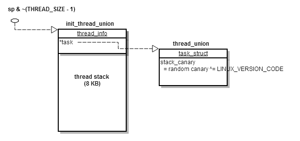

2015-06-27
==========

Summary
-------

- mm/page_allo.c, __alloc_pages_slowpath()진행 중


진행 내용
--------

### migrate_prep_local()

lru_add_drain() -> lru_add_drain_cpu()

#### lru_add_drain_cpu()
여기에서 swap.c에서 가지고 lruvec들을 zone의 lruvector로 이동시킨다.

### pagevec_lru_move_fn()

이 함수는, pvec이 가지고 있는 page들을 전달된 functor로 보내져서 필요한 동작을 하게 된다.
이후에,  각 페이지들은 release되며, pvec은 초기화 된다.

```
 375 static void pagevec_lru_move_fn(struct pagevec *pvec,
 376         void (*move_fn)(struct page *page, struct lruvec *lruvec, void *arg),
 377         void *arg)
 378 {
 379         int i;
 380         struct zone *zone = NULL;
 381         struct lruvec *lruvec;
 382         unsigned long flags = 0;
 383         
 384         // for (i = 0; i < pvec->nr; i++)
 385         for (i = 0; i < pagevec_count(pvec); i++) {
 386                 struct page *page = pvec->pages[i];
 387                 struct zone *pagezone = page_zone(page);
 388                 
 389                 if (pagezone != zone) {
 390                         if (zone)
 391                                 spin_unlock_irqrestore(&zone->lru_lock, flags);
 392                         zone = pagezone;
 393                         spin_lock_irqsave(&zone->lru_lock, flags);
 394                 }
 395                 // 현 버전에서는 zone->lruvec를 반환. 
 396                 lruvec = mem_cgroup_page_lruvec(page, zone);
 397                 // 이 함수 포인터 내에서 실질적으로 lruvec 값이 이동된다.
 398                 (*move_fn)(page, lruvec, arg);
 399                 // 2015-04-11 여기까지.
 400                 // 함수포인터로 전달받은 lru_deactivate_fn동작 살펴봄.
 401         }
 402         if (zone)
 403                 spin_unlock_irqrestore(&zone->lru_lock, flags);
 404         
 405         // 2015-04-18 시작
 406         release_pages(pvec->pages, pvec->nr, pvec->cold);
 407         // 2015-04-25 end
 408         pagevec_reinit(pvec);
 409 }

```

### pagevec_move_tafil_fn()

```
 415 // 자식이 속한 lruvec->lists에서 가장 마지막으로 이동하는 기능
 416 static void pagevec_move_tail_fn(struct page *page, struct lruvec *lruvec,
 417                                  void *arg)
 418 {
 419         int *pgmoved = arg;
 420 
 421         if (PageLRU(page) && !PageActive(page) && !PageUnevictable(page)) {
 422                 // LRU 상태이면서 페이지 비활성화, 꺼내기 가능한 경우
 423                 // swapback상태 여부 확인, 이 값에 따라 관리되는 컨테이너가 다르다.
 424                 enum lru_list lru = page_lru_base_type(page);
 425                 // 파라미터로 넘어온 lruvec의 리스트에 page->lru값을 마지막 항목에 넣는다. 
 426                 list_move_tail(&page->lru, &lruvec->lists[lru]);
 427                 (*pgmoved)++;
 428         }
 429 }
```

### lru_deactivate_fn

Active상태의 page를 zone->lruvec에서 삭제하고 그리고 pvec에서도 삭제한다.
이 페이지를 다시 zone->lruvec[lru]에 추가시켜준다.(inactive 리스트에 추가될 것이다.)


```
 690 static void lru_deactivate_fn(struct page *page, struct lruvec *lruvec,
 691                               void *arg)
 692 {  
... 
 707         // PG_Active 플래그 설정 여부 확인
 708         active = PageActive(page);
 709         // PG_SwapBacked플래그 설정 여부 확인
 710         // 참인 경우 파일, 아닌 경우 익명의 페이지(메모리 상주, 임시 페이지 ...)
 711         file = page_is_file_cache(page);
 712         // 파일 타입인지 아닌지 검사
 713         lru = page_lru_base_type(page);
 714         // 페이지 링크드 리스트 내에서 제거 및 존 내 플래그 재세팅
 715         del_page_from_lru_list(page, lruvec, lru + active);
 716         // active flag 꺼줌
 717         ClearPageActive(page);
 718         // referenced flag 꺼줌
 719         ClearPageReferenced(page);
 720         // 페이지 링크드 리스트 내에 추가 및 zone 플래그 재세팅
 721         add_page_to_lru_list(page, lruvec, lru);
...


```


Issues & Topics
---------------

### TestBit
```C
<include/asm-generic/bitops/non-atomic.h>

111 static inline int test_bit(int nr, const volatile unsigned long *addr)
112 {
113     return 1UL & (addr[BIT_WORD(nr)] >> (nr & (BITS_PER_LONG-1)));
114 }

<include/linux/signal.h>

 57 // 2015-06-27 set->sig 비트필드 검사
 58 static inline int sigismember(sigset_t *set, int _sig)
 59 {
 60     unsigned long sig = _sig - 1;
 61     // _NSIG_WORDS == 64/32
 62     if (_NSIG_WORDS == 1)
 63         return 1 & (set->sig[0] >> sig); 
 64     else 
 65         return 1 & (set->sig[sig / _NSIG_BPW] >> (sig % _NSIG_BPW));
 66 } 

```

실습해보았다.

```C
#include <stdio.h>

#define BIT_PER_INT	32
#define BITWORD(n)	(n / BIT_PER_INT)	

int testbit(unsigned int nr, unsigned int *val) {
	// (nr & (BIT_PER_INT - 1)) == (nr % BIT_PER_INT)
	return 1 & (val[BITWORD(nr)] >> (nr & (BIT_PER_INT - 1)));
}

int main() {

	int val = 1 << 0;

	printf("%d\n", testbit(0, &val));

	val = 1 << 1;
	printf("%d\n", testbit(0, &val));
	printf("%d\n", testbit(1, &val));
	printf("%d\n", testbit(2, &val));


	return 0;
}
```

### thread_info

아래 내용은 11차 A분들의 후기 내용을 발췌한 것이다.

```
(5) boot_init_stack_canary 함수에서 아래 코드의 current 는 current task 를 말하는데
      이를 가지고 있는 thread info 의 위치는 어디이고 언제 셋팅이 되었는가 ?
      current->stack_canary = canary;

     current 는 아래의 매크로를 통해 thread_info 자료구조가 가지고 있는 task struct 를 가리킵니다.

#define get_current() (current_thread_info()->task)
#define current get_current()
     current_thread_info 함수에서 말 그대로 현재(current)의 thread info 객체 위치를 찾기 위해,
     아래와 같이 sp 값에서 하위 13 bit 를 clear 시키는군요.
     이는 곧 sp 가 가지고 있는 주소값에서 8 KB 이하의 값을 잘라내는 것이므로, 
     stack 의 시작주소를 나타낸다고 볼 수 있습니다.
     그런데, 이러한 시작주소를 struct thread_info 포인터로 typecasting 한 것을 리턴하고 있네요.
     이는 곧 thread 가 사용하는 stack 의 처음 부분에는 thread_info 자료구조가 들어있다는 말이겠네요.

static inline struct thread_info *current_thread_info(void)
{
    register unsigned long sp asm ("sp");
 
    return (struct thread_info *)(sp & ~(THREAD_SIZE - 1));
}
     sp 값을 start_kernel 로 튀기 전에 kernel/head-common.S 에서 다음과 같이 설정한 적이 있습니다.

__mmap_switched:
    adr r3, __mmap_switched_data
    ...
 ARM(   ldmia   r3, {r4, r5, r6, r7, sp})    <=== 요부분
 
    .type   __mmap_switched_data, %object
__mmap_switched_data:
    .long   __data_loc          @ r4
    .long   _sdata              @ r5
    .long   __bss_start         @ r6
    .long   _end                @ r7
    .long   processor_id            @ r4
    ...
    .long   init_thread_union + THREAD_START_SP @ sp   <=== 요부분
    .size   __mmap_switched_data, . - __mmap_switched_data
     sp 의 시작주소값을 init_thread_union + THREAD_START_SP 값으로 설정했었네요.

     sp 시작주소 설정 시에 보이는 init_thread_union 은 아래와 같이 thread_union union 인데,
     이 union 은 선언될 때 THREAD_SIZE (8 KB)만큼 공간이 잡히게 되고, 그 첫부분은 thread_info 용도로 
    사용하고 나머지 공간은 stack 원래의 용도로 사용됩니다.

extern union thread_union init_thread_union;
 
union thread_union {
    struct thread_info thread_info;
    unsigned long stack[THREAD_SIZE/sizeof(long)];
};

지금까지 살펴본 바로는 thread stack 의 맨위(시작지점)에 thread_info 가 위치한다는 것은 확인했습니다.
     하지만, 아직 이게 어떻게 초기화되었는지는 모르는데요.

     init/init_task.c 에 보면 아래와 같이 선언된 부분을 볼 수 있습니다.
     __init_task_data 변수를 선언하고 있는데 선언함과 동시에 thread_info 를 초기화하고 있네요.
     초기화할 때는 INIT_THREAD_INFO 매크로를 사용하였고, 인자로 INIT_TASK 를 통해 초기화된 
     init_task 를 넘겨주고 있습니다.
     즉, 빌드할 때 자동으로 task_struct 형 변수 init_task 가 잡힌 후 초기화되고,
     thread_union 형 변수 __init_task_data 가 잡히고 초기화되네요.
     이 때 초기화되는 thread_union 내의 thread_info 안의 task 변수가 init_task 로 채워져서 
     thread 와 task 를 연결시키네요.

struct task_struct init_task = INIT_TASK(init_task);        <=== task_struct 초기화
EXPORT_SYMBOL(init_task);
 
union thread_union init_thread_union __init_task_data =     <=== thread_info 초기화 (init_task 와 연결)
    { INIT_THREAD_INFO(init_task) };
 
// arch/arm/include/asm/thread_info.h
#define INIT_THREAD_INFO(tsk)                       \
{                                   \
    .task       = &tsk,                     \
    .exec_domain    = &default_exec_domain,             \
    .flags      = 0,                        \
    .preempt_count  = INIT_PREEMPT_COUNT,               \
    .addr_limit = KERNEL_DS,                    \
    .cpu_domain = domain_val(DOMAIN_USER, DOMAIN_MANAGER) | \
              domain_val(DOMAIN_KERNEL, DOMAIN_MANAGER) |   \
              domain_val(DOMAIN_IO, DOMAIN_CLIENT),     \
    .restart_block  = {                     \
        .fn = do_no_restart_syscall,            \
    },                              \
}
     이렇게 초기화된 thread_info 내의 init_task 내에 stack_canary 변수가 있는데, 이곳에 get_random_bytes 에서
     구한 random canary 값을 저장해두는 것입니다.
     즉, 원래 의도는 task 별로 다른 canary 값을 사용하려던 것이었겠네요.
     하지만, ARM 은 이미 말씀드렸다시피 __stack_chk_guard 라는 global 변수에 이를 다시 할당하여
     다수의 task 가 공통으로 사용합니다.
     즉, SMP 환경에서도 task 가 자신만의 canary 값을 가지지 못한다는 말입니다.
     코드의 주석에도 아래와 같이 unfortunately 라고 표현했네요. ^^

    This unfortunately means that on SMP we cannot have a different canary value per task

     위의 모든 과정을 간단히 그림으로 그려보면 아래와 같습니다.
```


Reference & Resources
---------------------


External Links
---------------

TO DO
-----

아래 분석
- release_pages()
- pagevec_reinit()
