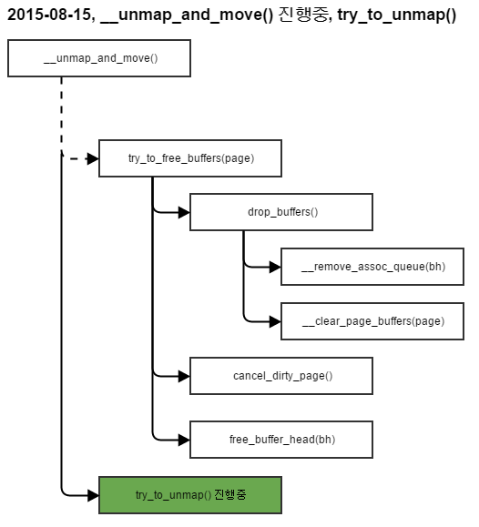

2015-08-15, Review
==================

진행 내용
-------

### compact_zone() -> migrate_pages() 진행중

migrate_pages() -> unmap_and_move()

#### unmap_and_move()

   1. compaction_alloc() -> isolate_freepages() -> isolate_freepages_block() 완료
   2. __unmap_and_move();  진행중
       - !trylock_page(page) -> lock_page(page) -> __lock_page(page)

#### __unmap_and_move()



Issues
------

### buffer_write_io_error(bh)은 어디에?

* 참고: http://furmuwon.egloos.com/11162904

buffer_head.h에서 매크로에 의해서 생성된다.

```C
<linux/buffer_head.h>
// 2015-08-15
enum bh_state_bits {
	BH_Uptodate,	/* Contains valid data */
	BH_Dirty,	/* Is dirty */
	BH_Lock,	/* Is locked */
	BH_Req,		/* Has been submitted for I/O */
	BH_Uptodate_Lock,/* Used by the first bh in a page, to serialise
			  * IO completion of other buffers in the page
			  */

	BH_Mapped,	/* Has a disk mapping */
	BH_New,		/* Disk mapping was newly created by get_block */
	BH_Async_Read,	/* Is under end_buffer_async_read I/O */
	BH_Async_Write,	/* Is under end_buffer_async_write I/O */
	BH_Delay,	/* Buffer is not yet allocated on disk */
	BH_Boundary,	/* Block is followed by a discontiguity */
	BH_Write_EIO,	/* I/O error on write */
	BH_Unwritten,	/* Buffer is allocated on disk but not written */
	BH_Quiet,	/* Buffer Error Prinks to be quiet */
	BH_Meta,	/* Buffer contains metadata */
	BH_Prio,	/* Buffer should be submitted with REQ_PRIO */
	BH_Defer_Completion, /* Defer AIO completion to workqueue */

	BH_PrivateStart,/* not a state bit, but the first bit available
			 * for private allocation by other entities
			 */
};
 
/*
 * macro tricks to expand the set_buffer_foo(), clear_buffer_foo()
 * and buffer_foo() functions.
 */
#define BUFFER_FNS(bit, name)						\
static inline void set_buffer_##name(struct buffer_head *bh)		\
{									\
	set_bit(BH_##bit, &(bh)->b_state);				\
}									\
static inline void clear_buffer_##name(struct buffer_head *bh)		\
{									\
	clear_bit(BH_##bit, &(bh)->b_state);				\
}									\
static inline int buffer_##name(const struct buffer_head *bh)		\
{									\
	return test_bit(BH_##bit, &(bh)->b_state);			\
}

/*
 * test_set_buffer_foo() and test_clear_buffer_foo()
 */
#define TAS_BUFFER_FNS(bit, name)					\
static inline int test_set_buffer_##name(struct buffer_head *bh)	\
{									\
	return test_and_set_bit(BH_##bit, &(bh)->b_state);		\
}									\
static inline int test_clear_buffer_##name(struct buffer_head *bh)	\
{									\
	return test_and_clear_bit(BH_##bit, &(bh)->b_state);		\
}

/*
 * Emit the buffer bitops functions.   Note that there are also functions
 * of the form "mark_buffer_foo()".  These are higher-level functions which
 * do something in addition to setting a b_state bit.
 */
BUFFER_FNS(Uptodate, uptodate)
BUFFER_FNS(Dirty, dirty)
TAS_BUFFER_FNS(Dirty, dirty)
BUFFER_FNS(Lock, locked)
BUFFER_FNS(Req, req)
TAS_BUFFER_FNS(Req, req)
BUFFER_FNS(Mapped, mapped)
BUFFER_FNS(New, new)
BUFFER_FNS(Async_Read, async_read)
BUFFER_FNS(Async_Write, async_write)
BUFFER_FNS(Delay, delay)
BUFFER_FNS(Boundary, boundary)
BUFFER_FNS(Write_EIO, write_io_error)
BUFFER_FNS(Unwritten, unwritten)
BUFFER_FNS(Meta, meta)
BUFFER_FNS(Prio, prio)
BUFFER_FNS(Defer_Completion, defer_completion)
```

전처리를 거치면 아래와 같이 함수들이 생성된다.
```C
static inline void set_buffer_uptodate(struct buffer_head *bh) { set_bit(BH_Uptodate, &(bh)->b_state); }
static inline void clear_buffer_uptodate(struct buffer_head *bh) { clear_bit(BH_Uptodate, &(bh)->b_state); } 
static inline int buffer_uptodate(const struct buffer_head *bh) { return test_bit(BH_Uptodate, &(bh)->b_state); }

static inline void set_buffer_dirty(struct buffer_head *bh) { set_bit(BH_Dirty, &(bh)->b_state); } 
static inline void clear_buffer_dirty(struct buffer_head *bh) { clear_bit(BH_Dirty, &(bh)->b_state); } 
static inline int buffer_dirty(const struct buffer_head *bh) { return test_bit(BH_Dirty, &(bh)->b_state); }

static inline int test_set_buffer_dirty(struct buffer_head *bh) { return test_and_set_bit(BH_Dirty, &(bh)->b_state); } 
static inline int test_clear_buffer_dirty(struct buffer_head *bh) { return test_and_clear_bit(BH_Dirty, &(bh)->b_state); }

static inline void set_buffer_locked(struct buffer_head *bh) { set_bit(BH_Lock, &(bh)->b_state); } 
static inline void clear_buffer_locked(struct buffer_head *bh) { clear_bit(BH_Lock, &(bh)->b_state); } 
static inline int buffer_locked(const struct buffer_head *bh) { return test_bit(BH_Lock, &(bh)->b_state); }

static inline void set_buffer_req(struct buffer_head *bh) { set_bit(BH_Req, &(bh)->b_state); } 
static inline void clear_buffer_req(struct buffer_head *bh) { clear_bit(BH_Req, &(bh)->b_state); } 
static inline int buffer_req(const struct buffer_head *bh) { return test_bit(BH_Req, &(bh)->b_state); }

static inline int test_set_buffer_req(struct buffer_head *bh) { return test_and_set_bit(BH_Req, &(bh)->b_state); } 
static inline int test_clear_buffer_req(struct buffer_head *bh) { return test_and_clear_bit(BH_Req, &(bh)->b_state); }

static inline void set_buffer_mapped(struct buffer_head *bh) { set_bit(BH_Mapped, &(bh)->b_state); } 
static inline void clear_buffer_mapped(struct buffer_head *bh) { clear_bit(BH_Mapped, &(bh)->b_state); } 
static inline int buffer_mapped(const struct buffer_head *bh) { return test_bit(BH_Mapped, &(bh)->b_state); }

static inline void set_buffer_new(struct buffer_head *bh) { set_bit(BH_New, &(bh)->b_state); } 
static inline void clear_buffer_new(struct buffer_head *bh) { clear_bit(BH_New, &(bh)->b_state); } 
static inline int buffer_new(const struct buffer_head *bh) { return test_bit(BH_New, &(bh)->b_state); }

static inline void set_buffer_async_read(struct buffer_head *bh) { set_bit(BH_Async_Read, &(bh)->b_state); } 
static inline void clear_buffer_async_read(struct buffer_head *bh) { clear_bit(BH_Async_Read, &(bh)->b_state); } 
static inline int buffer_async_read(const struct buffer_head *bh) { return test_bit(BH_Async_Read, &(bh)->b_state); }

static inline void set_buffer_async_write(struct buffer_head *bh) { set_bit(BH_Async_Write, &(bh)->b_state); } 
static inline void clear_buffer_async_write(struct buffer_head *bh) { clear_bit(BH_Async_Write, &(bh)->b_state); } 
static inline int buffer_async_write(const struct buffer_head *bh) { return test_bit(BH_Async_Write, &(bh)->b_state); }

static inline void set_buffer_delay(struct buffer_head *bh) { set_bit(BH_Delay, &(bh)->b_state); } 
static inline void clear_buffer_delay(struct buffer_head *bh) { clear_bit(BH_Delay, &(bh)->b_state); } 
static inline int buffer_delay(const struct buffer_head *bh) { return test_bit(BH_Delay, &(bh)->b_state); }

static inline void set_buffer_boundary(struct buffer_head *bh) { set_bit(BH_Boundary, &(bh)->b_state); } 
static inline void clear_buffer_boundary(struct buffer_head *bh) { clear_bit(BH_Boundary, &(bh)->b_state); } 
static inline int buffer_boundary(const struct buffer_head *bh) { return test_bit(BH_Boundary, &(bh)->b_state); }

static inline void set_buffer_write_io_error(struct buffer_head *bh) { set_bit(BH_Write_EIO, &(bh)->b_state); } 
static inline void clear_buffer_write_io_error(struct buffer_head *bh) { clear_bit(BH_Write_EIO, &(bh)->b_state); } 
static inline int buffer_write_io_error(const struct buffer_head *bh) { return test_bit(BH_Write_EIO, &(bh)->b_state); }

static inline void set_buffer_unwritten(struct buffer_head *bh) { set_bit(BH_Unwritten, &(bh)->b_state); } 
static inline void clear_buffer_unwritten(struct buffer_head *bh) { clear_bit(BH_Unwritten, &(bh)->b_state); } 
static inline int buffer_unwritten(const struct buffer_head *bh) { return test_bit(BH_Unwritten, &(bh)->b_state); }

static inline void set_buffer_meta(struct buffer_head *bh) { set_bit(BH_Meta, &(bh)->b_state); } 
static inline void clear_buffer_meta(struct buffer_head *bh) { clear_bit(BH_Meta, &(bh)->b_state); } 
static inline int buffer_meta(const struct buffer_head *bh) { return test_bit(BH_Meta, &(bh)->b_state); }

static inline void set_buffer_prio(struct buffer_head *bh) { set_bit(BH_Prio, &(bh)->b_state); } 
static inline void clear_buffer_prio(struct buffer_head *bh) { clear_bit(BH_Prio, &(bh)->b_state); } 
static inline int buffer_prio(const struct buffer_head *bh) { return test_bit(BH_Prio, &(bh)->b_state); }

static inline void set_buffer_defer_completion(struct buffer_head *bh) { set_bit(BH_Defer_Completion, &(bh)->b_state); } 
static inline void clear_buffer_defer_completion(struct buffer_head *bh) { clear_bit(BH_Defer_Completion, &(bh)->b_state); } 
static inline int buffer_defer_completion(const struct buffer_head *bh) { return test_bit(BH_Defer_Completion, &(bh)->b_state); } 
```

### __anon_vma_interval_tree_iter_first() 어디에?

include/linux/interval_tree_generic.h에서 매크로에 의해서 생성된다.

매크로를 이용해서 정의하고 있다.
```C
<mm/interval_tree.c>

 72 INTERVAL_TREE_DEFINE(struct anon_vma_chain, rb, unsigned long, rb_subtree_last,
 73                      avc_start_pgoff, avc_last_pgoff,
 74                      static inline, __anon_vma_interval_tree)
 
<linux/interval_tree_generic.h>
#define INTERVAL_TREE_DEFINE(ITSTRUCT, ITRB, ITTYPE, ITSUBTREE,           \
                 ITSTART, ITLAST, ITSTATIC, ITPREFIX)         \

// Callbacks for augmented rbtree insert and remove

static inline unsigned long __anon_vma_interval_tree_compute_subtree_last(struct anon_vma_chain *node)
{
    unsigned long max = avc_last_pgoff(node), subtree_last;
    if (node->rb.rb_left) {
        subtree_last = rb_entry(node->rb.rb_left,
                    struct anon_vma_chain, rb)->rb_subtree_last;
        if (max < subtree_last)
            max = subtree_last;
    }
    if (node->rb.rb_right) {
        subtree_last = rb_entry(node->rb.rb_right,
                    struct anon_vma_chain, rb)->rb_subtree_last;
        if (max < subtree_last)
            max = subtree_last;
    }
    return max;
}

RB_DECLARE_CALLBACKS(static, __anon_vma_interval_tree_augment, struct anon_vma_chain, rb,
             unsigned long, rb_subtree_last, __anon_vma_interval_tree_compute_subtree_last)

// Insert / remove interval nodes from the tree

static inline void __anon_vma_interval_tree_insert(struct anon_vma_chain *node, struct rb_root *root)
{
    struct rb_node **link = &root->rb_node, *rb_parent = NULL;
    unsigned long start = avc_start_pgoff(node), last = avc_last_pgoff(node);
    struct anon_vma_chain *parent;

    while (*link) {
        rb_parent = *link;
        parent = rb_entry(rb_parent, struct anon_vma_chain, rb);
        if (parent->rb_subtree_last < last)
            parent->rb_subtree_last = last;
        if (start < avc_start_pgoff(parent))
            link = &parent->rb.rb_left;
        else
            link = &parent->rb.rb_right;
    }

    node->rb_subtree_last = last;
    rb_link_node(&node->rb, rb_parent, link);
    rb_insert_augmented(&node->rb, root, &__anon_vma_interval_tree_augment);
}

static inline void __anon_vma_interval_tree_remove(struct anon_vma_chain *node, struct rb_root *root)
{
    rb_erase_augmented(&node->rb, root, &__anon_vma_interval_tree_augment);
}

//
// Iterate over intervals intersecting [start;last]
//
// Note that a node's interval intersects [start;last] iff:
//  Cond1: avc_start_pgoff(node) <= last
//  and
//  Cond2: start <= avc_last_pgoff(node)


static struct anon_vma_chain *
__anon_vma_interval_tree_subtree_search(struct anon_vma_chain *node, unsigned long start, unsigned long last)
{
    while (true) {
        //
        // Loop invariant: start <= node->rb_subtree_last
        // (Cond2 is satisfied by one of the subtree nodes)

        if (node->rb.rb_left) {
            struct anon_vma_chain *left = rb_entry(node->rb.rb_left,
                          struct anon_vma_chain, rb);
            if (start <= left->rb_subtree_last) {
                //
                // Some nodes in left subtree satisfy Cond2.
                // Iterate to find the leftmost such node N.
                // If it also satisfies Cond1, that's the
                // match we are looking for. Otherwise, there
                // is no matching interval as nodes to the
                // right of N can't satisfy Cond1 either.

                node = left;
                continue;
            }
        }

        if (avc_start_pgoff(node) <= last) {        // Cond1
            if (start <= avc_last_pgoff(node))  // Cond2
                return node;    // node is leftmost match
            if (node->rb.rb_right) {
                node = rb_entry(node->rb.rb_right,
                        struct anon_vma_chain, rb);
                if (start <= node->rb_subtree_last)
                    continue;
            }
        }
        return NULL;    // No match
    }
}

static inline struct anon_vma_chain *
__anon_vma_interval_tree_iter_first(struct rb_root *root, unsigned long start, unsigned long last)
{
    struct anon_vma_chain *node;

    if (!root->rb_node)
        return NULL;
    node = rb_entry(root->rb_node, struct anon_vma_chain, rb);
    if (node->rb_subtree_last < start)
        return NULL;
    return __anon_vma_interval_tree_subtree_search(node, start, last);
}

static inline struct anon_vma_chain *
__anon_vma_interval_tree_iter_next(struct anon_vma_chain *node, unsigned long start, unsigned long last)
{
    struct rb_node *rb = node->rb.rb_right, *prev;

    while (true) {
        //
        // Loop invariants:
        //  Cond1: avc_start_pgoff(node) <= last
        //  rb == node->rb.rb_right
        //
        // First, search right subtree if suitable

        if (rb) {
            struct anon_vma_chain *right = rb_entry(rb, struct anon_vma_chain, rb);
            if (start <= right->rb_subtree_last)
                return __anon_vma_interval_tree_subtree_search(right,
                                start, last);
        }

        // Move up the tree until we come from a node's left child
        do {
            rb = rb_parent(&node->rb);
            if (!rb)
                return NULL;
            prev = &node->rb;
            node = rb_entry(rb, struct anon_vma_chain, rb);
            rb = node->rb.rb_right;
        } while (prev == rb);

        // Check if the node intersects [start;last]
        if (last < avc_start_pgoff(node))       // !Cond1
            return NULL;
        else if (start <= avc_last_pgoff(node))     // Cond2
            return node;
    }
}
```


External Links
--------------
